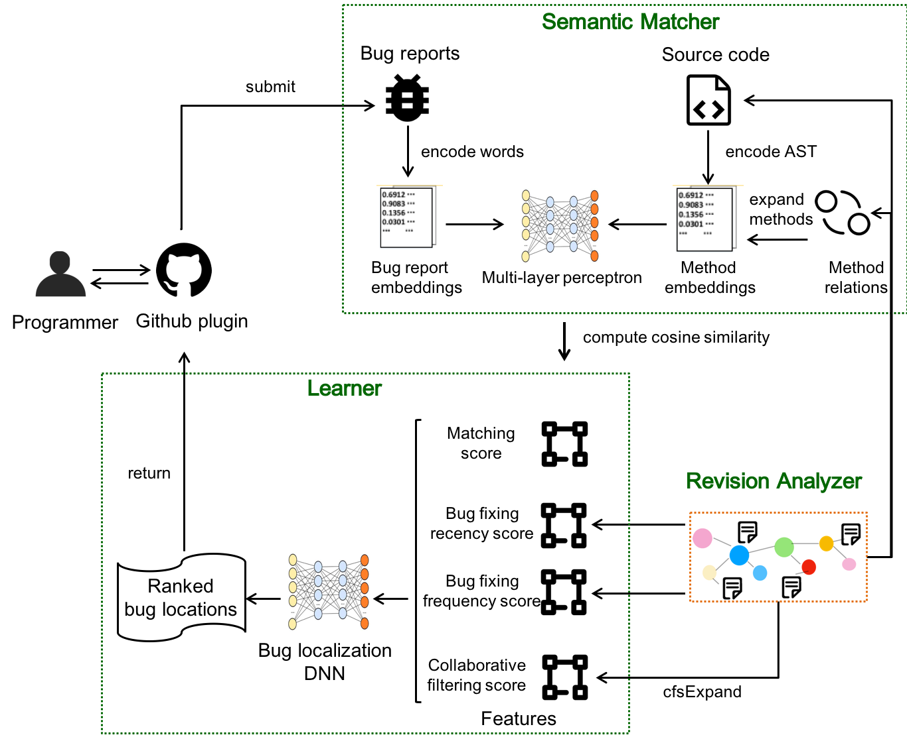

# BugPecker
BugPecker: Locating Faulty Methods with Deep Learning on Revision Graphs

## Github plugin

We have implemented the BugPecker tool as a Github plugin in Java. After submitting a bug report in the Github issue system, programmers could get ranked suspicious buggy methods later from BugPecker. The github plugin is available [here](https://github.com/apps/bugpecker), which presents more detailed information and user guide about the Github plugin.

## Introduction

The task of locating the potential buggy files in a software project is called bug localization. To help programmers in bug localization process, many automated bug localization approaches have been proposed. Although these approaches achieved promising results at file level, method level bug localization is still challenging because of semantic gap between bug reports and code, and insufficient information of short methods. 

In this paper, we present BugPecker, a novel method-level bug localization approach with Deep Learning on Revision Graphs. BugPecker makes the significant improvements, because it introduces deep learning and is the first to encode the commits and bug reports into revision graphs. 

The above figure shows the overview of BugPecker. It consists of three components: (1) The *revision analyzer* constructs revision graphs from commits; (2) The *semantic matcher* calculates semantic similarity scores between bug reports and methods; (3) The *learner* locates buggy methods with a non-linear DNN that takes the semantic matching feature, the revised collaborative filtering feature, the bug fixing recency feature and bug fixing frequency feature as its input.

We evaluated BugPecker on three open source projects. The results show that BugPecker could localize bugs at method level more precisely than the baselines, which are [DNNLoc-m](https://doi.org/10.1109/ICPC.2017.24) and [BLIA 1.5](https://doi.org/10.1016/j.infsof.2016.11.002), and achieving a MAP of 0.263 and a MRR of 0.291.

## Revision analyzer

The revision analyzer, a component of BugPecker, builds revision graphs from commits and past bug reports. Revision graphs contain some code related entities and relations between them, mainly method entities and similar-to and call relations between method entities. Each code related entities have a "version" attribute, which means it was extracted from the specific version of source code. The revision analyzer serves as a web service, and the way to access the web service and more implementation details is available [here](https://github.com/RAddRiceee/BugPecker/tree/master/RevisionAnalyzer).

## Semantic matcher and Learner

The Semantic matcher and the Learner are both components of BugPecker. Thr former calculates the semantic similarity between a method and a bug report and passes the semantic matching score to the Learner. The Learner
combines the semantic mathing score and the other three kinds of scores(bug fixing recency score, bug fixing frequency score, collaborative filtering score) to select the possible buggy methods from repository and rank them
by supocious score. More implementation details is available [here](https://github.com/RAddRiceee/BugPecker/tree/master/MatcherAndLearner).